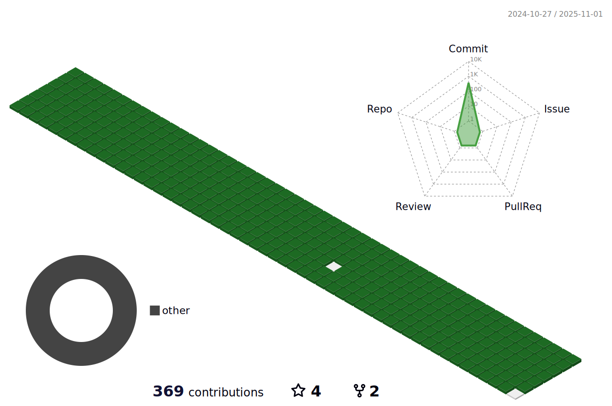

<!--page badge button: [Title](https://simpleicons.org/)
shape of badge: plastic, flat, flat-square, for-the-badge, social
-->

<!-- theme of git stat: [Title](https://github.com/anuraghazra/github-readme-stats/blob/master/themes/README.md)-->

  
  

	

 

	<h3>📚 Tech Stack 📚</h3>
	
✨ Platforms & Languages ✨

 

	
🛠 IDE tools 🛠

	

 

	
📡 SNS & Portfolio 📡

	<!--

-->

 

	 

 

🆠Baekjoon solved Rank ğŸ†

	

 

